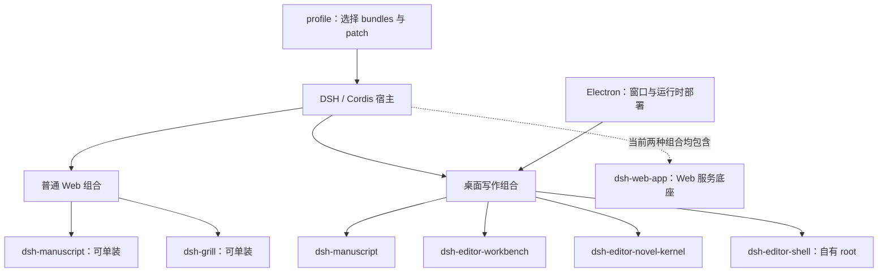
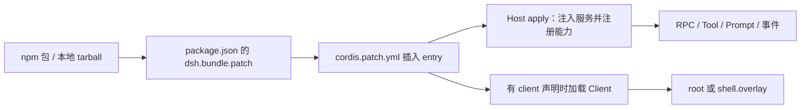
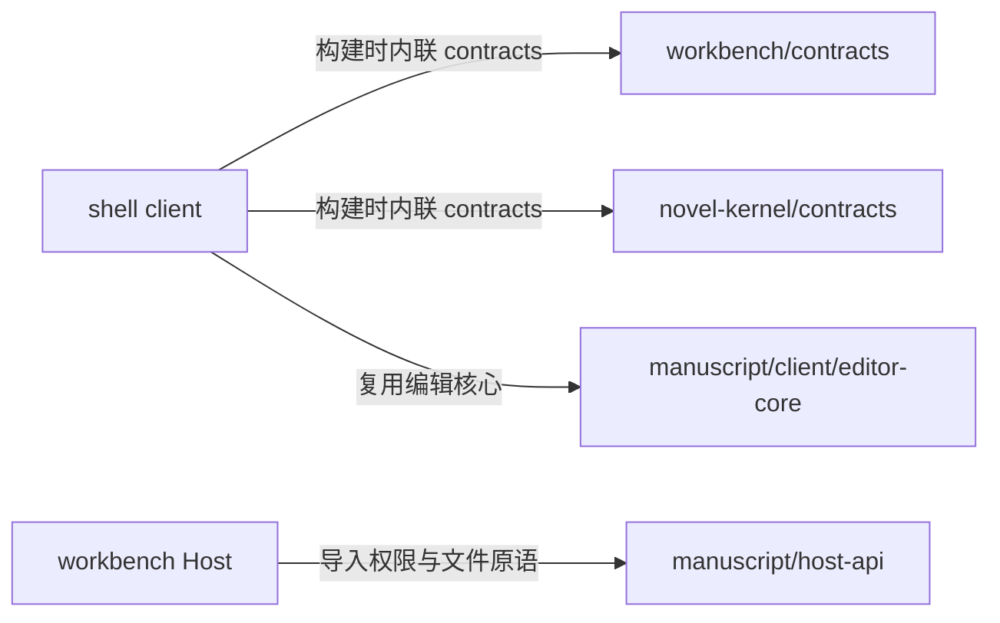
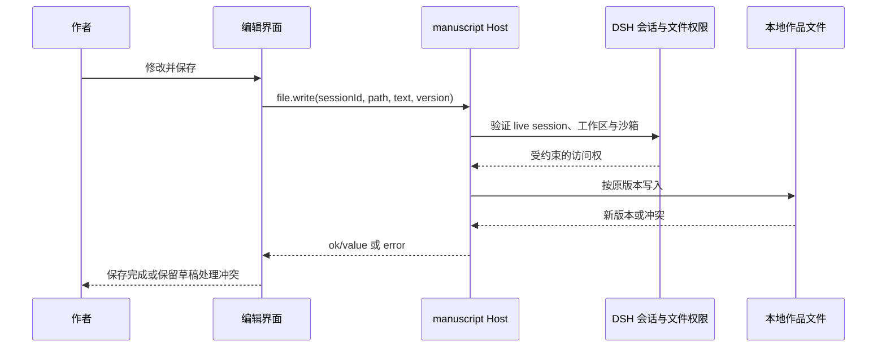
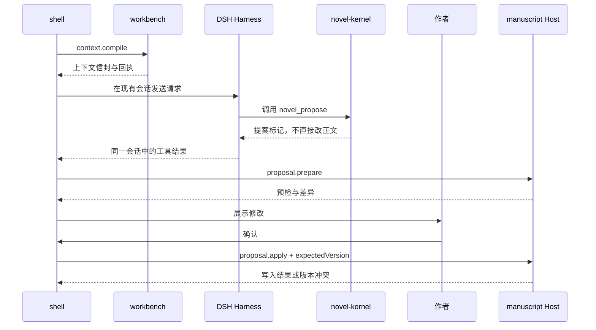

# DSH 插件组合能力验证

验证日期：2026-09-09。源码基线：`a6efa1a88749a0136e4d7289cf0ca69145bda0b4`，工作区开始时干净。运行时基线：DSH `0.1.1-rc.2`。本文验证当前实现，不把后续设想当作已具备能力。

## 1. 结论：已经能组合，但还不是通用的自由选装平台

DSH Editor 已经证明，可以把业务 Host、工具、提示词和自有界面组装为一个完整产品。它的能力不局限于给官方聊天页加按钮。但“不同 npm 包”“独立安装”“可单独工作”“可卸载且剩余功能仍工作”是四个不同标准。

| 要验证的命题 | 当前结论 | 证据边界 |
| --- | --- | --- |
| 几个插件可以分别安装、组合使用 | **两个公开插件成立** | 本轮 tarball 安装/卸载矩阵通过 |
| 桌面产品由插件组成 | **成立** | 四个业务包进入专用 profile；Electron 承担进程和窗口 |
| 不以官方 DSH Web 主界面为中心 | **成立** | shell 接管 `root`，官方许多界面入口被禁用 |
| 可以不装 `dsh-web-app` | **尚未证明，当前仍装载** | 桌面 profile 明确包含该 bundle，复用 client runtime 等服务 |
| 普通业务不经过 LLM / Agent | **已有实现** | 搜索、文件读写、卡片、确定性校对、快照走 RPC |
| 不加载 Harness 也能运行这些插件 | **尚未成立** | 文件操作依赖 live session；manuscript 注入 `llm`，workbench 注入 `tools` |
| 三个桌面插件任意单装、互换、卸载 | **不成立** | 固定四包装配；缺少 workbench/kernel 的启动负向验证通过 |
| 任意业务都能靠现成积木完成 | **不能据此下结论** | 当前证据来自写作业务；通用第三方能力组合还需要独立样例 |

“不调用模型”不等于“不依赖 Harness 的服务”。“替换官方界面”也不等于“去掉官方 Web 运行底座”。这两组区别决定了下一步真正需要验证什么。

## 2. 先看图

- [交互图：界面、能力与宿主边界](diagrams/plugin-composition-boundaries.html)：可切换普通业务、小说助手、公开插件三个视角，支持缩放和关系追踪。
- [已有完整插件拓扑](diagrams/dsh-editor-plugins.html)。
- [已有确认写入时序](diagrams/author-confirm-write.html)。
- [已有桌面进程图](diagrams/dsh-editor-runtime.html)。

新增交互图只展示主要依赖，manuscript 是兼有 Host 和 Client 的包，并非纯后端。完整接口和调用路径在下文展开。

### 装配图：同一宿主，不同产品组合



两条产品组合不是要求同时启动两个 Host。桌面 profile 不包含 `dsh-grill`；它已有更专用的 novel-kernel，不能把五个包一股脑安装当作支持的组合。

## 3. 各插件负责什么

| 包 | 它负责的范围 | 对外接口 | 当前安装形式与依赖 |
| --- | --- | --- | --- |
| `dsh-manuscript` | 文本树、稿件安全读写、草稿、搜索、FIM/选段改写候选、单文件提案；可关闭稿纸抽屉及共享编辑器 | `/manuscript`；`shell.overlay`；`host-api`；`client/editor-core` | 公开 tarball；不依赖 grill；Host 依赖 connection、sessions、workspaceRegistry、fs、sandboxPolicy、llm、storageDomain |
| `dsh-grill` | `scaffold_novel` 工具、guard 与四种小说协作模式的提示词 | `dsh-grill/tools`、`dsh-grill/workflow`；`grill:workflow` | 公开 tarball；不依赖 manuscript；无自有 UI，依赖 tools/systemPrompt 服务 |
| `dsh-editor-workbench` | 项目初始化、导入、目录操作、卡片、章节状态、进度、校对、快照、归档、上下文编译 | `/dsh-editor-workbench`；`contracts`；`novel_overview` 工具 | 桌面固定包，`private: true`；依赖 manuscript 的 `host-api` 及 DSH 服务 |
| `dsh-editor-novel-kernel` | 小说知识、检索、观察、提案、索引及 scratch 工具、写入 guard、系统提示词、知乎知识库服务 | `novel_*` / 知乎工具；`/novel-kernel`；`contracts`；`dsh-editor/zhihu-search` 计量事件 | 桌面固定包，`private: true`；依赖 tools、systemPrompt、fs、credentials、connection、sandboxPolicy |
| `dsh-editor-shell` | 三栏界面、编辑状态、工作台面板、对话投影、作者确认、设置与导出 | `root`；设置 schema；消费其他包 RPC/contracts/editor-core | 桌面固定包；依赖另外三个包。定位为私有交付，但当前 manifest **没有** `private: true`，不能把文档定位当发布保护 |
| `apps/desktop` | 窗口、进程监督、内置运行时、专用 profile 部署、桌面生命周期 | Electron 与运行时启动边界 | 应用宿主，不是 DSH 插件；当前部署脚本固定四个业务包 |

workbench 中“文件复制”“校对”“卡片”“快照”等是一个包内的功能模块，还不是分别可安装的插件。shell 的各个面板同样不是独立插件。

shell 未标记 `private: true` 是清单与交付定位之间的缺口；本轮只记录，没有改变发布策略或执行发布。

## 4. 插件怎样接起来

### 安装与加载



`package.json` 管理依赖与导出；`dsh.profile.bundles` 选择安装组合；`cordis.patch.yml` 声明具体 entry；Host/Client 的 `inject` 决定装配所需服务。它们一起构成当前积木接口，不需要另建插件注册中心。

两个公开包的 entry 为 `manuscript`、`grill-tools`、`grill-workflow`。桌面额外使用 `editor-workbench`、`editor-novel-kernel`、`editor-shell`。entry id、prompt 名称和 root 所有权需要避免冲突。

### 代码依赖与运行时调用不同



contracts 是类型、常量、解析器和纯函数，不是另一个服务。RPC 才是界面与 Host 的运行时边界。当前 shell 不是通用面板容器：它直接知道卡片、快照、小说提案等业务，替换 Host 时必须维持相应协议，不能只改包名。

### 接口速查

| 接口 | 调用者 → 提供者 | 代表操作 | 必须保留的语义 |
| --- | --- | --- | --- |
| `/manuscript` | manuscript UI / shell → manuscript Host | `tree.list`、`file.read/write`、`draft.*`、`search.text`、`fim.complete`、`patch.complete`、`proposal.prepare/apply` | 文件路径相对 workspace；读返回 version；写按版本门禁；草稿不是正文 |
| `/dsh-editor-workbench` | shell → workbench Host | `project.*`、`cards.*`、`proofread.scan`、`context.compile`、`snapshot.*`、`archive.*`、`entry.*` | live session 重建权限；导入/恢复 token 和重新验证；冲突不静默覆盖 |
| `/novel-kernel` | shell → kernel Host | `zhihu.knowledge.bases`、`zhihu.knowledge.upload` | 本地 RPC、Host 端凭据和参数校验；不是通用文件接口 |
| Tool / Prompt | DSH 执行系统 → grill / kernel / workbench | `scaffold_novel`、`novel_propose`、`novel_overview` 等 | 工具执行仍归 DSH；插件注册能力，不创建第二套执行循环 |
| slot | Client → DSH client runtime | manuscript 的 `shell.overlay`；shell 的 `root` | 附加 UI 与主界面所有权不同；不要叠加两个产品 root |
| 对话适配 | shell → SessionFace / connection | send、cancel、snapshot、model、permission、approval、questions | 同一真实会话；不复制另一套聊天和工具状态 |
| 计量事件 | kernel → manuscript 监听器 | `dsh-editor/zhihu-search` | 辅助用量统计；不是业务执行成功的唯一依据 |

三个业务 channel 都以 loopback authority 注册。一般文件请求携带 `sessionId`，Host 根据 live session 的不可变 cwd、workspaceRegistry 和 sandboxPolicy 重建访问权。部分项目入口、用量与知乎 RPC 是例外，详见[完整接口手册](plugin-architecture.md)。loopback 本身不是多用户身份认证。

RPC 基本结果形状为：

```ts
type RpcResult<T> =
  | { ok: true; value: T }
  | { ok: false; error: { code: string; message: string; details: unknown } }
```

这是经 DSH connection 使用的 channel/endpoint 契约，不能把 `/manuscript` 当作未经验证的普通 REST URL 用 curl 调用。

## 5. 两条工作流程：普通业务与 AI 协作

### 普通保存：没有模型参与



搜索、校对、卡片、快照也有直接 RPC 路径。它们说明 DSH 可以承载普通业务；但这条路径仍使用会话权限，因此不能据此宣布 Harness 已经可移除。

### AI 修改：提案与写入分开



这里展示单文件 edit/create。拆章、合章和批量重命名通过 workbench 的 proposal 接口。索引与 scratch 有专门的工具写入路径；不要把“正文提案需确认”误读成“任何文件写入都走提案”。

## 6. 本轮验证结果与边界

| 检查 | 本轮结果 | 实际证明了什么 |
| --- | --- | --- |
| `pnpm test:e2e:matrix` | 通过：构建成功，2 个 tarball 校验通过；5 个状态、5 次转换、4 次浏览器探测，issues=0 | 两个公开插件的当前产物可组合、拆除并启动；没有源码软链接替代 tarball |
| `pnpm test` | 91 个测试文件、807 个测试通过 | 现有逻辑、RPC、边界与界面辅助逻辑回归通过；不等于全部真实用户操作 |
| `node scripts/prepare-desktop-dev.mjs` + `node e2e/missing-private-plugin.mjs` | 通过；分别移除 workbench/kernel 后均退出码 1 | 当前桌面装配确实要求这两个包，缺包不会假装启动成功 |
| `node e2e/desktop.mjs` | 通过；首次启动、已配置启动、多窗口及草稿恢复 | 自有 Shell 显示、官方首页隐藏；保存冲突不覆盖磁盘，草稿恢复与冲突副本、关闭后端口释放 |
| 新增架构图 | showcase 9/9 检查通过，0 错误、0 警告；四种桌面尺寸均无溢出 | 图示结构、布局和可读性；不是产品运行证明 |

矩阵顺序为：仅 manuscript → 两者共存 → 卸载 manuscript 仅剩 grill → 恢复两者 → 卸载 grill 仅剩 manuscript。恢复两者的中间状态只验配置，没有额外启动浏览器。grill-only 是卸载后的状态，不是另一个全新 HOME 的首次安装；本轮也未调用付费模型验证 scaffold 的在线生成流程。

原始本地结果位于 `e2e/out/plugin-matrix/report.json`、`.pack/release-manifest.json`、`.pack/missing-private-plugin-smoke.json` 和 `.dev/plugin-composability-*.log`。这些输出可能被下次验证覆盖；[本轮摘要](verification/plugin-composability-2026-09-09.json)保存了基线、产物哈希及结果。

本轮没有执行发布、远程部署、全新无 Web profile 测试、无 Harness 进程测试、桌面三个包的独立 tarball 安装、卸载后的业务数据兼容测试或跨版本升级矩阵。图示与这份文档也不改变现有产品的固定装配策略。

## 7. 要验证“搭积木完成更广泛需求”，下一步最小实验

下面是建议的验证顺序，尚未实施，不是新增平台架构的批准方案。

1. **先拿一个非 AI 用例作为验收目标。** 例如普通文件预览/检索：不用模型、不注册 Tool/Prompt，提供一个 Host RPC 和一个小界面，单独装入测试 profile。现有稿纸与搜索可以提供参考，但其硬性注入仍需检查。判据是业务操作真实完成、可单独卸载且其他能力仍可用。
2. **再验证自有 Shell 的组合消费。** 同一个业务 Host 同时给官方界面附加入口和自有界面消费；两边调用相同 RPC。业务包不导入 shell 源码，也不把普通操作绕到 Agent。当前 editor-core/contracts 的复用是起点。
3. **明确“不依赖官方 Web”的验收层级。** 当前已经满足自有主界面；若目标是 profile 完全不包含 `dsh-web-app`，先从其真实依赖中挑出必要的 connection/runtime/settings/renderer 服务，在隔离 profile 运行同一用例。不能只删 bundle 后根据页面能打开就宣布完成。
4. **只有确实要求无 Harness 才继续拆。** 停止装载模型、tools、systemPrompt 等服务，再检查普通业务能否启动。目前 session-based workspace authority 是实质依赖；若要替换，必须给出等价的工作区权限和版本冲突保证。先通过一个用例，不先建新的通用权限框架。
5. **再选值得独立交付的能力。** 只有出现独立消费者、不同启用周期或明确卸载需求时，才把校对/卡片/快照等拆成新包。每个新增包交付 manifest、patch、Host/Client 入口、契约和安装/移除测试。现有 shell 里的面板不会因移动文件自动成为可插拔能力。

最终的产品验收应是：“选择一份组合配置，就能完成目标业务；加入助手只增加智能协作能力；移除可选能力后，其余功能与数据仍完整。”当前项目完成了其中公开双插件的组合，以及桌面自有界面这两块；普通业务脱离 Harness 和桌面任意选装仍需上述独立实验证据。

## 8. 如何复现公开插件的单独安装

先在仓库执行 `pnpm build` 与 `pnpm pack:plugins`。当前产物为 `.pack/dsh-manuscript-0.1.0.tgz` 和 `.pack/dsh-grill-0.1.0.tgz`。以下示例使用新的测试 HOME；路径替换为真实的 tarball 绝对路径，不应误用日常 profile。

```powershell
$env:DSH_HOME = Join-Path $env:TEMP ('dsh-compose-' + [guid]::NewGuid().ToString('N'))
dsh plugin --profile web add 'file:D:/0 code/dsh-editor/.pack/dsh-manuscript-0.1.0.tgz'
dsh plugin --profile web add 'file:D:/0 code/dsh-editor/.pack/dsh-grill-0.1.0.tgz'
dsh --profile web --no-open --host 127.0.0.1 --port 3000
# 结束宿主后，验证分别移除：
dsh plugin --profile web remove dsh-manuscript
dsh plugin --profile web remove dsh-grill
```

在独立测试终端运行，结束后关闭该终端即可避免临时环境变量影响后续操作。也可直接运行 `pnpm test:e2e:matrix`，它自动隔离 HOME、选择空闲端口并清理测试宿主。本轮实际执行的是自动矩阵，不是以上固定端口示例。独立 tarball 并不代表其 npm/宿主依赖已全部离线内置。

## 9. 源码入口

| 需要核对的事实 | 入口 |
| --- | --- |
| 公开交付只有两个包 | [根 package.json](../package.json)、[产物校验](../scripts/verify-artifacts.mjs) |
| 安装/卸载矩阵的真实范围 | [plugin-matrix.mjs](../e2e/plugin-matrix.mjs) |
| 桌面仍含 Web bundle | [profile/package.json](../apps/desktop/resources/profile/package.json)、[禁用与配置项](../apps/desktop/resources/profile/cordis.patch.yml) |
| 桌面固定四包 | [prepare-desktop-dev.mjs](../scripts/prepare-desktop-dev.mjs) |
| 缺包启动边界 | [missing-private-plugin.mjs](../e2e/missing-private-plugin.mjs) |
| 主界面注册与对话投影 | [root-registration.ts](../packages/dsh-editor-shell/src/root-registration.ts)、[adapter.ts](../packages/dsh-editor-shell/src/adapter.ts) |
| manuscript 服务注入 | [index.ts](../packages/dsh-manuscript/src/index.ts) |
| workbench 服务与 host-api 耦合 | [index.ts](../packages/dsh-editor-workbench/src/index.ts) |
| kernel 工具、prompt、RPC、事件 | [index.ts](../packages/dsh-editor-novel-kernel/src/index.ts) |
| 逐项 RPC 字段 | [plugin-architecture.md](plugin-architecture.md)，修改实现时仍需重新核对 |
