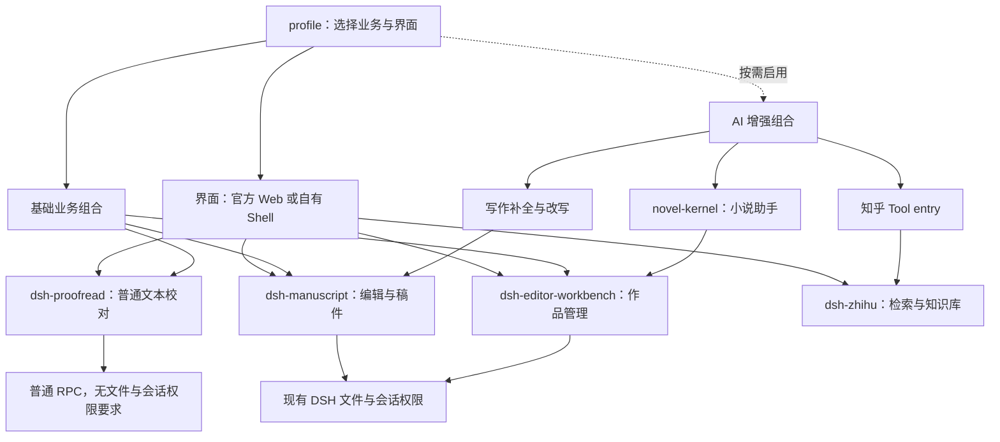

# DSH 插件拆分与组合演进计划

> 历史记录：本文保留文中日期、版本和当时验证结果，不代表桌面 0.2.0 的当前入口或发布状态。当前说明见 [文档索引](README.md)，本轮验证见 [0.2.0 验收记录](release-0.2.0.md)。

状态：已按用户授权进入实施与验收。原计划日期：2026-09-09；源码基线：`a6efa1a88749a0136e4d7289cf0ca69145bda0b4` / DSH `0.1.1-rc.2`。下文保留原设计与退出条件，当前结果以[实施记录](plugin-modularization-progress.md)和[组合指南](plugin-composition-guide.md)为准；未发布。

## 1. 建议与目标

**继续拆分。优先让一个完整业务能力能独立安装、被不同界面使用，再让 AI 成为可选增强。** 当前最大的限制是安装清单、Host 服务、业务接口和界面相互绑定；仅增加包数量无法解除这些限制。

你的愿景在本计划中落实为三个结果：

1. DSH 承载普通业务和智能业务。业务可以由用户界面直接发起，也可以由 Agent 调用同一能力。
2. 官方 Web、自有桌面 Shell 是不同的消费方式。业务插件不依赖某个具体产品的组件和全局状态。
3. 组合由 profile 决定。用户选择所需能力后，能安装、启动、使用、移除、恢复，且其余能力和数据保持完整。

DSH Editor 继续是写作产品，作为组合能力的第一个真实消费者；通用能力通过另一份轻量组合来验证。无需先把写作产品变成通用工作台，也不在本仓库重写 DSH。

### 要达到的解耦层级

| 层级 | 判据 | 本计划安排 |
| --- | --- | --- |
| A：不用模型 | 普通业务运行不产生 LLM 请求 | 已有部分实现；各阶段继续保护 |
| B：业务插件不要求 AI 服务 | 该插件 Host 无 tools/llm/systemPrompt/session 注入也能完成一个实际用例 | 第一阶段用纯文本校对证明；不把它扩大成整个编辑器都无 session |
| C：自有界面消费业务 | 同一 tarball 在官方 Web 与自有 Shell 中提供同一业务结果 | 第一阶段和第三阶段验证 |
| D：业务组合可选择 | 可选插件移除后，剩余操作可用且不被依赖自动装回 | 第二至四阶段验证 |
| E：整个应用不装 Agent 或官方 Web bundle | 实际进程加载清单、启动和业务操作均通过 | 第五阶段单独研究；上游耦合可能需要上游改动 |

A—D 是这轮演进的主线。E 保留为愿景的一部分，但不阻塞前面可交付的成果。尤其当前上游 WorkspaceRuntime 依赖 SessionRuntime，`session.create` 同时创建 Agent，不能通过隐藏聊天面板就声称实现了 E。

## 2. 什么值得拆、什么暂时保持

新名字为本地工作名，不代表 npm 名称可用、已发布或已冻结的协议。

| 当前归属 | 建议边界 | 优先级与理由 |
| --- | --- | --- |
| workbench 的 `proofreadText` 与默认规则 | **新 `dsh-proofread`**：纯文本校对引擎、只读文本 RPC、插件自有最小 UI；引擎也作为库导出 | **第一优先**。不需要凭据、文件权限或模型；小说和普通中文文稿均可消费 |
| workbench 的 `scanProofread`、人物卡对照、作品词表 | **仍归 workbench**，调用共享校对引擎 | 与作品文件、卡片和扫描范围相连；保留原来的完整校对行为 |
| manuscript 的 FIM、选段改写、LLM 计量 | 先分成可独立启用的 Host entry，再视安装需要形成 **`dsh-writing-assist`** | 让基础稿纸与模型增强分开；不能同时迁移草稿格式 |
| workbench 的 `novel_overview` Tool；shell 的 Chat/上下文联动 | 工具注册与 Chat 挂载按 AI 组合启用 | 普通项目能力不应因没有 tools 而不能启动；不增加一套聊天状态 |
| kernel 的知乎客户端、工具、知识库 RPC 和计量 | **新 `dsh-zhihu`**，普通服务 entry 与可选 Tool entry 同包 | 独立凭据、联网失败和用途；可服务小说以外的需求 |
| kernel 的小说知识、提案、索引、scratch、guard、prompt | 保留 **`dsh-editor-novel-kernel`** | 同一个小说协作闭环，先不要一工具一包 |
| manuscript 的文件读写、草稿、搜索、提案提交、编辑核心 | 保留 **`dsh-manuscript`** | 同一编辑生命周期；不能拆散版本门禁和草稿并发所有权 |
| workbench 的项目、卡片、进度、归档、快照、导入 | 保留 **`dsh-editor-workbench`** | 多数共用作品权限与数据生命周期；暂没有第二个独立消费者证明拆包收益 |
| shell 的布局、主题、窗口与产品导航 | 保留 **`dsh-editor-shell`**，减少对可选业务的直接导入 | Shell 负责摆放与当前编辑上下文，插件负责自己的业务界面 |
| `dsh-grill` | 保留公开兼容包 | 不强行合并入桌面小说助手，不改变既有 Web 用户的安装行为 |
| Electron 与桌面部署 | 保留应用宿主 | 窗口和运行时不是普通业务插件；部署清单改为反映选定组合 |

近期新增包以 `dsh-proofread`、`dsh-zhihu` 为主；`dsh-writing-assist` 在入口解耦后再决定物理拆包时点。contracts 暂随能力包导出；不先创建 `dsh-core`、`dsh-common` 或全局 `contracts` 包。

## 3. 目标组合图

以下是目标图，虚线表示可选增强，不是当前运行拓扑。

不是所有组合都必须带上全部业务包。纯文本校对组合只需要其 RPC/Client 支持；完整写作组合仍包含稿纸、workbench 和对应界面。只有具有依赖闭包的组合才受支持，“任意卸载”不包括移除某个仍被选中功能必需的底座。

### 推荐的四份组合配置

| 组合 | 用户能做什么 | 验证重点 |
| --- | --- | --- |
| 文本校对示例 | 粘贴任意中文文稿、得到校对结果 | 无小说目录、无模型配置、无文件权限依赖 |
| 基础写作 | 读写、草稿、搜索、作品管理、原有校对与快照 | 无 AI 功能可用时仍完成写作；暂可保留 DSH session 服务 |
| 智能写作 | 基础写作 + Chat + FIM/改写 + 小说工具 | 原有作者确认、取消、审批与冲突保障不变 |
| 写作 + 外部资料 | 基础/智能写作 + 知乎 | 无凭据或移除知乎不影响编辑；Tool entry 可与普通服务分开启用 |

配置优先沿用 profile 的 package manifest、bundles、patch；先用明确的组合文件和现有构建脚本，不增加插件市场、远程控制面、自动求解器或热更新系统。

## 4. 实施阶段与退出条件

### P0：固定迁移边界，不先改业务行为

**交付：** 一份简明迁移映射和基线用例清单，与本文及现有接口手册一起维护。

- 逐项记录旧包名、entry id、channel、endpoint、Tool 名、设置 namespace、storage domain、作品文件路径及其唯一所有者。
- 明确三种依赖：必需运行依赖、可选能力、纯构建时依赖。特别核对 shell 对内联 contracts 的依赖是否导致已移除的 Host 包被安装器重新带回。
- 固定默认智能写作组合，保留两个公开包旧安装方式。
- 做两个短探针：自有 root 是否实际消费 `shell.overlay`；最小 connection Host 是否能在没有 Agent 服务时加载。探针决定 P1 的接入方式，不能只依据类型声明断言可行。
- 将“缺可选插件正常运行”和“已选择的必需插件缺包时失败”分成不同测试。现有缺 workbench/kernel 测试目前正确，不能直接删除来制造绿灯。

**验收：** 新旧调用关系无双重 channel/Tool 所有者；现有公开安装矩阵、草稿冲突/恢复与桌面关键用例可继续复用。开始实施时确认源码是否变化，有变化才更新基线证据。

### P1：完成一个独立非 AI 业务插件——文本校对

**目标：** 用当前业务代码完成第一块可独立交付的通用积木，证明不是“把函数换个文件夹”。

**具体改动：**

1. 从 `proofread.ts` 提取 `proofreadText` 及其纯函数、规则和相关类型。纯引擎不再间接导入 workbench、cards、manuscript Host 或 Node FS。
2. `dsh-proofread` 提供一个有大小/结果数量上限的文本校对 RPC，首版形状为 `text.check({ text, kinds? })` → `{ findings, habitStats, truncated }`（名称待 P0 固定）。只开放界面实际使用的规则选择；不把内部 `ProofreadTextOptions` 的词典、阈值和 `maxFindings` 全量暴露给调用者。Host 固定文本与输出预算，沿用现有单篇文本和结果上限作为起点。Host entry 只依赖通信服务，不读路径、不写文件、不调用模型。
3. 插件拥有可直接使用的最小界面：输入/粘贴文本 → 发起校对 → 查看结果。官方 Web 使用既有附加 slot；自有 Shell 增加受控挂载点或复用现有 slot，先按真实能力选择，不假设旧 Shell 已经支持动态面板。
4. workbench 原来的 `proofread.scan` 继续负责读取工作区、加载作品词表、卡片对照和扫描预算，再调用同一个纯引擎。默认桌面校对的 `card` 检查不能丢失。当前 `habit` 是跨文件汇总后判断，不能改为逐篇结果简单相加；共用的分析原语随纯引擎导出，保留整组聚合语义，不复制算法。
5. 发布形状先用本地 tarball 证明；校对引擎导出是“库”，Host/Client/patch 才构成“可安装插件”。依赖该引擎的 workbench 会要求该包存在，但不必启用额外 UI entry。

**首版范围：** 新插件输入文本只返回建议，不直接修改编辑器或文件。选中文本接入由 Shell 传副本完成；如以后增加应用修改，仍通过原编辑器事务、版本检查和保存流程。

**验收：**

- 全新隔离 profile 只加这个业务 tarball，能完成普通中文文稿校对；不创建小说目录、不要求模型配置。
- 同一测试文本经官方 Web 和自有 Shell 得到相同结果，任一入口不导入另一入口源码。
- 在真实 Cordis Host 中不提供 sessions、fs、llm、tools、systemPrompt，文本校对 entry 仍可调用；这证明插件 B 层，不等于完整 DSH Web 进程不加载这些服务。
- 移除该插件的独立示例 UI/entry 后，宿主其他功能正常；若同时选择了依赖其引擎的 workbench，禁止把依赖包删除而声称可选卸载。区分停用 UI 与移除整个包。
- 原作品校对的全部默认规则、人物卡对照、跨文件口癖统计、字数限制和错误语义保留；新 RPC 不把超时/错误伪装成“没有问题”。
- 文本在请求期间变化时，旧结果不得定位到新文本；插件维护输入修订和请求标识，切换或卸载取消请求、释放 RPC/slot 注册。加载、空结果、错误、键盘操作均有实际验收。

**预计复杂度：中。** 主要工作是迁移纯函数依赖与两个界面的接入，而非校对算法重写。P0 + P1 是建议先实施的第一批。

### P2：让 AI 与外部资料成为可选能力

分两个可独立验收的增量，不同时更换持久化格式。

**P2a——AI 注册解耦：** 以“基础写作”这份可运行 profile 为消费者，不为不存在的模式拆分。

- manuscript 分离基础 RPC 与 FIM/patch/LLM 计量的注册入口；基础 entry 不硬性注入 `llm`。
- workbench 的 `novel_overview` Tool 注册移到明确的可选 AI entry，业务 RPC entry 不硬性注入 `tools`。
- 基础写作组合不启动补全、自动索引或隐藏的模型任务；Chat 的缺失是一种受支持状态，UI 不循环调用不存在的服务。
- 初期允许同包多 entry，先实现“可不启用”；只有完成独立依赖清单和旧包兼容策略后，才声明“AI 包可以不安装”。
- 若形成 `dsh-writing-assist`，旧 `/manuscript` 的 FIM/patch endpoint 只能由原 channel 所有者转发给显式的辅助能力接口，不能两个包各注册一次 `/manuscript`。不复制分发器或增加通用 RPC 路由框架。

**P2b——知乎独立：** 以可从写作组合移除、也可装入不带 novel-kernel 的资料查询组合为验收用例；若决定不交付该用例，暂停物理拆包，先保留内部边界。

- 将 `zhihu-client/search/tools/knowledge` 等迁到 `dsh-zhihu`，普通服务/知识库 RPC 与 Tool entry 分开注入。
- kernel 移除对知乎凭据和网络能力的必需依赖；知乎不可用不影响本地小说工具。
- 同步迁移 shell 中的知乎设置/入口与 manuscript 中的知乎计量所有权，保留原凭据引用和既有计量数据。
- `/novel-kernel` 的旧知乎 endpoint 和 `/manuscript` 的旧计量 endpoint 暂由原所有者转发；直接安装新包走其新接口。旧、新入口同时装载只记一次用量、不重复注册同名 Tool。

**验收：** 基础写作在不启用上述 AI/知乎 entry 时能保存、搜索、校对和做快照；完整组合仍能执行补全/提案和审批；无 token、超时及移除知乎只影响知乎功能。在线付费调用与确定性测试分开记录，未实际调用时不写“在线验证通过”。

**预计复杂度：高。** 风险集中在服务注入、旧接口转发、计量与界面隐式请求，不能仅看单元测试是否通过。

### P3：Shell 按能力接入，第二个插件验证扩展面

**目标：** 接入第二个独立能力时不再反复改 Shell 的业务判断。先接校对，再接知乎，两个真实消费者共同约束接口。

- 复用 DSH 的 slot 声明、注入、注册和销毁机制。必要时只增加一个小的产品面板 slot，并给出 slot 名、最少参数和生命周期契约。
- 插件拥有 UI 与请求状态；Shell 只提供挂载位置、可选的当前文本快照/导航回调和关闭方式，不泄露整个 ShellContext。
- 插件等待 slot 声明，slot 撤销或插件卸载时释放注册和请求。缺能力时入口不出现；坏包、版本不兼容或初始化失败应明确报错，不当作正常缺失。
- Chat 可以暂留 shell 包内，按组合挂载；不要为了“更纯”马上新建聊天插件和第二套对话协议。
- 不承诺热卸载正在运行的模型任务。初期安装变更在关闭宿主、保存草稿后重启生效；进程内 effect 清理仍要验证。

**验收：** 两个插件以同一挂载契约接入自有 Shell；在官方 Web 有自己的入口；移除其中一个 entry 后另一个继续工作；重开不存在重复入口、监听器或悬空加载；键盘操作、焦点恢复和明暗主题不退化。

**预计复杂度：中到高。** P1 只做其必需的最小接入，P3 再用第二个消费者修正边界，不先建设任意面板系统。

### P4：把模块化变成可交付的组合

**交付：** 可复制的组合配置、本地独立 tarball、插件开发示例及安装说明。插件市场 UI 不属于此阶段。

- 公开打包脚本从固定“两包”扩展为明确维护的产物清单；逐包检查入口、resources、exports、peer/runtime 依赖和不应带入的代码。
- 桌面 prepare/dev/runtime/verify 脚本读取同一组选定业务包，避免开发可用、便携产物漏包。继续沿用版本固定、整树哈希和原子部署保障。
- 扩展安装矩阵：全新单装、两种安装顺序、双向移除、重装、缺必需包、可选 entry 禁用、重启后数据保留。只覆盖声明支持的组合，不穷举所有包的幂集。
- 默认写作 profile 使用新组合保留原功能；实验性非 AI 示例使用另一 profile，不改日常 HOME。
- 附一个最小插件示例：manifest、patch、Host/Client、契约、安装/卸载测试。用本文已完成的真实校对插件作范本，避免代码生成框架。

**验收：** 干净机器/隔离 HOME 从 tarball 装出声明的组合；不依赖仓库软链接；卸载不会被 shell 的错误 runtime dependency 重新拉回；完整桌面最终产物也能完成所选组合的代表操作。

**预计复杂度：中。** 跨平台交付按项目已有支持范围逐一验证，未测平台明确保留证据缺口；发布仍是单独动作。

### P5：评估精简 DSH 宿主，输出实验证据

此阶段独立于功能拆包，研究结果可以是“需要上游支持”，不能靠宽松权限或假 session 凑成功。

**实验一：没有 `dsh-web-app` bundle。** 从其实际 patch 和 client 服务依赖推导最小装配，先启动纯文本校对示例，验证连接、资源加载、界面、重连与关闭。bundle 名消失、底层官方服务仍存在是允许的，但报告必须写清楚。

**实验二：进程不加载 Agent 执行能力。** 先选无文件权限需求的文本校对，再考虑文件型应用。记录实际服务/模块加载和是否创建 Agent，不能仅以无网络流量判定。上游 client runtime 的 package/peer 依赖与运行注入都要核查。

**文件型应用的单独决策：** 当前工作区身份来自 live session。若现有 DSH 无独立工作区授权入口，保留 session 方案并记录限制，或在另一个明确范围里提出上游修改；不在 Renderer 接受任意 cwd，不绕过 sandboxPolicy，不在此计划内发明第二套权限系统。

**退出条件：** 形成可运行的最小 profile 和回执，或给出准确的上游阻塞服务及最小改动建议。整个编辑器完全无 Harness 不作为 P0—P4 的完成门槛。

## 5. 跨阶段必须保持的合同

| 边界 | 迁移规则 |
| --- | --- |
| 包与启用 | 区分 npm 依赖、bundle 选择和 entry 启用；包在磁盘上不等于功能激活，禁用 entry 也不等于没有安装包 |
| 旧接口 | 第一个版本维持旧调用形状与结果语义，明确转发所有者；完成消费者迁移和版本策略后再决定撤旧时间 |
| RPC | 每个 channel 只有一个注册者；可选能力用明确引用/现有服务接口连接，不靠捕捉未知 endpoint 来猜安装状态 |
| 持久化 | 作品 Markdown、draft owner/revision/baseVersion、domain name/version、设置 namespace、快照与导入回执保持；迁移时必须写出回滚条件 |
| 权限 | 文件请求仍由 Host 从 session 重建权限；纯文本 RPC 不接受文件路径，也不因此获得文件访问权 |
| 错误 | “未启用”与“已启用但启动失败”分开；不把缺依赖、接口不兼容、校对失败归零成成功 |
| 生命周期 | 取消正在进行的请求、处置 slot 和监听器；不让重新加载重复注册工具、重复记录用量 |
| 界面 | root 只有一个产品所有者；插件贡献自己面板，不能接管另一产品的整个根界面 |
| AI | 保留同一个 Session/Chat/Tool/审批所有者；正文写入仍需作者确认与版本门禁 |
| 信任 | Cordis 同进程插件不是安全沙箱。独立安装不自动意味着可以运行不可信代码；插件隔离不是本轮拆分的交付承诺 |

物理搬迁与协议升级分开提交。兼容入口用于过渡，不能永久保留两份实现。若旧版本不能读取新写入数据，则不承诺只换回代码即可回滚；P0—P4 优先不改数据格式。

## 6. 文件迁移地图与执行分工

| 工作包 | 主要路径 | 主验收 |
| --- | --- | --- |
| 纯校对抽取 | `packages/dsh-editor-workbench/src/proofread*.ts`、相关 contracts/resources → `packages/dsh-proofread/` | 引擎无 Host/卡片反向依赖；旧 scan 输出不变 |
| 校对双界面 | 新插件 Client；`packages/dsh-editor-shell/src/client/root.ts` 的挂载边界 | 真实文本在两个界面均可校对 |
| AI 注册分离 | `packages/dsh-manuscript/src/index.ts`、`rpc/fim.ts`、`rpc/patch.ts`、`rpc/usage.ts`；workbench `index.ts`/`workbench-tools.ts` | 基础 entry 无 llm/tools 强注入，完整模式不退化 |
| 知乎迁移 | kernel `zhihu-*.ts` 与 `index.ts`；manuscript `rpc/zhihu-usage.ts`；Shell 知乎入口 | 凭据/失败/卸载与小说分离，用量不丢不重 |
| Shell 可选能力 | `client/root.ts`、`client/chat.ts`、`adapter.ts`、包 manifest 和构建配置 | 缺可选功能可写作；无错误 runtime 依赖 |
| 组合交付 | profile manifest/patch；`scripts/prepare-*.mjs`、`verify-artifacts.mjs`、`e2e/plugin-matrix.mjs`、缺包测试 | tarball 与桌面最终位置均验证 |

主代理持有需求、共享接口、manifest/lockfile、组合配置、Git 与验收。前端实施按现有约定交给 Kimi K3；普通后端与独立调查按任务适配使用 Grok/Cursor，必要时 Terra 接手；评审只读。共享文件不交给两个写入者。此计划没有提前派发实施任务。

## 7. 批次建议与完成定义

**先做 P0 + P1。** 完成后你应该拿到一个真正可以单独安装的非 AI 插件，官方 Web 和自有 Shell 都能使用；原写作流程仍正常。这是第一个可体验、可否证的交付，不以“包拆好了”作为完成标准。

随后做 P2a/P2b，逐步把智能协作与外部资料变为可选；P3/P4 在两个真实插件基础上完成界面和交付组合。P5 作为独立的宿主精简实验，证据决定是否需要上游工作。

不提供无依据的日历承诺。每阶段以上述退出条件结算；首批完成后，按真实改动规模、宿主约束和验收成本估算后续工期。

**整条主线完成时：** 一个普通业务插件可以独立安装并用于两种界面；完整写作产品仍保留现有保障；可选 AI/资料能力的禁用或移除不影响基础写作；组合从交付产物可复现；依赖关系和不支持的组合可解释。

## 8. 依据与本轮审查

- [上一轮验证文档](plugin-composability-validation.md)与[验证回执](verification/plugin-composability-2026-09-09.json)：当时 807 测试、公开安装矩阵及桌面验证通过；本轮没有重新运行产品测试。
- [现有接口手册](plugin-architecture.md)与[产品边界](product-principles.md)：保留写作产品身份、同一权限/会话所有者和作者确认。
- 本轮重新读取了 manuscript/workbench/kernel 的服务注册、校对函数依赖、Shell 根界面导入、桌面打包清单，以及本机固定版本的 client runtime slot/Workspace/Session 说明。
- 已完成一位只读 `overdesign_guard` 审查，结论为“纯文本校对先行，缩小首次边界”。已采纳：首批只新增一个包、取消全量 AI 拆分前置、复用 slots、缩小 RPC 选项、保留跨文件统计、验证结果过期与卸载清理。
- 保留审查中的条件性建议：AI 拆分由基础写作组合驱动，知乎拆分由独立资料查询/移除用例驱动；暂不把卡片与快照单独打包。新增包、入口与组合均为建议，未实现。
